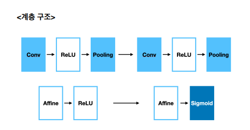
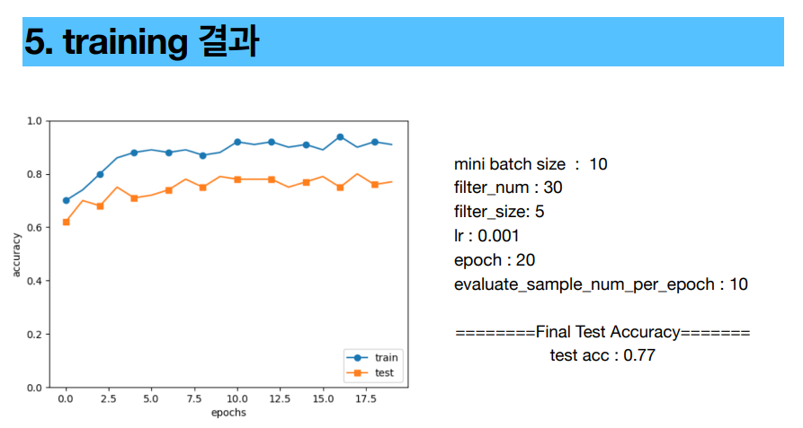

# Car-License-Plate-Detection

CNN을 직접 구현하여 차량 번호판을 탐지하는 프로젝트입니다.

* CNN 계층 구조
  * Conv-ReLU-Pooling-Conv-ReLU-Pooling-Affine-ReLU-Affine-ReLU 로 구성

* 데이터셋 = image 2140장, xml 2140장 (외국 차량 번호판)

 

* 테스트 결과 정확도
  * test acc: 77%

