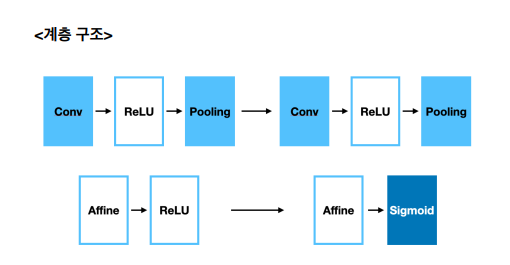
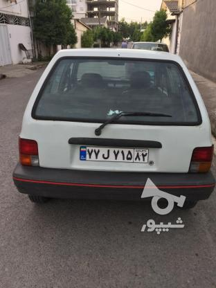

# Car-License-Plate-Detection

CNN을 직접 구현하여 차량 번호판을 탐지하는 프로젝트입니다.

CNN 계층 구조

Conv-ReLU-Pooling-Conv-ReLU-Pooling-Affine-ReLU-Affine-ReLU 로 구성

데이터셋 = image 2140장, xml 2140장 (외국 차량 번호판)

테스트 결과 정확도

test acc: 77%
[테스트 결과](./images/화면 캡처 2022-12-27 010418.png)
