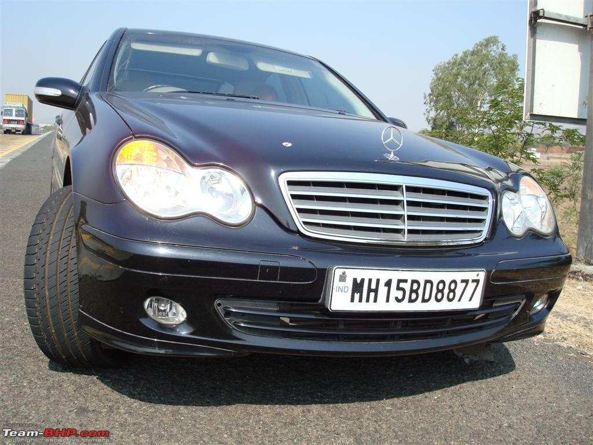

# Car-License-Plate-Detection

CNN을 직접 구현하여 차량 번호판을 인식하는 프로젝트입니다.
   

* CNN 계층 구조
  * Conv-ReLU-Pooling-Conv-ReLU-Pooling-Affine-ReLU-Affine-ReLU 로 총 4층 구성

   

* 데이터셋 = image 2140개, xml 2140개 (외국 차량 번호판)

 
   

* input layer : 224 X 224 = 50176
* ouuput layer : 4
* 테스트 결과 정확도
  * test acc : 77%

